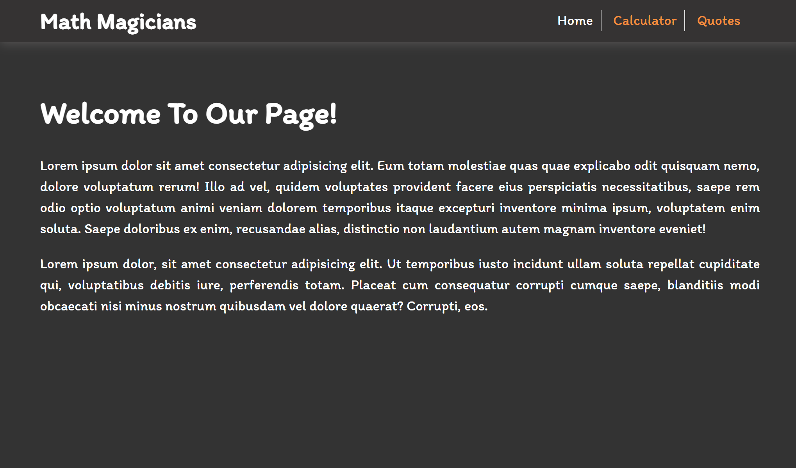
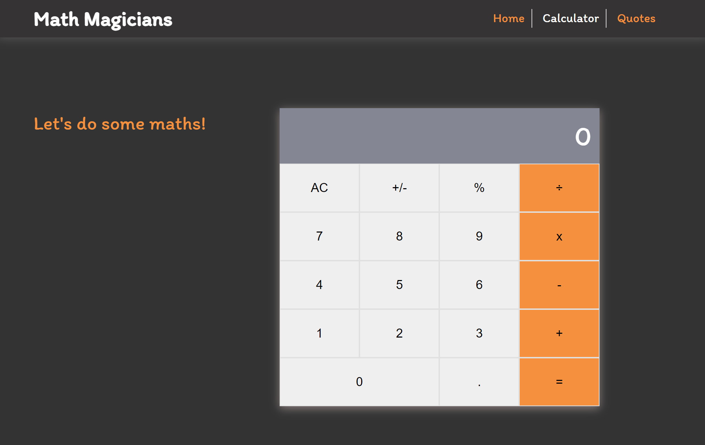
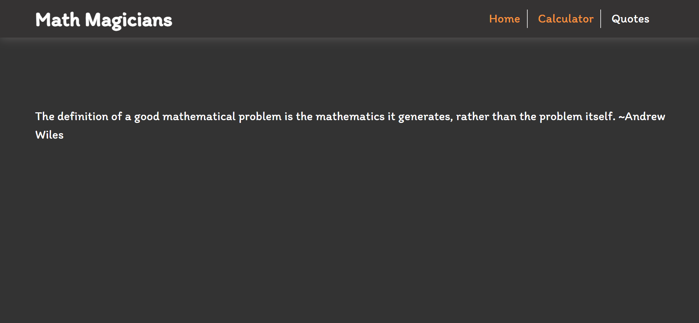

# Math Magicians
> Math magicians is a website for all fans of mathematics. It is a Single Page App (SPA) that allows users to make simple calculations, and read a random math-related quote.

# Live Link

Kindly click [here](https://dammyshittu.github.io/Math-Magicians/) to view the live demo of the app.

# Screenshots

<table>
  <tr>
    <td>Home</td>
     <td>Calculator</td>
     <td>Quote</td>
  </tr>
  <tr>
    <td></td>
    <td></td>
    <td></td>
  </tr>
 </table>

# Getting Started

To get a local copy up and running follow these simple steps.

- You can clone this repo by typing `git clone https://github.com/DammyShittu/Math-Magicians.git` on your terminal.

- Type `cd Math-Magicians` to access the project on the terminal.
  
- Run `npm install` from your editor's terminal.

- Run `npm start` from your editor's terminal to run the app in the development mode.

- Run `npm run build` to build the app for production.
# Testing

- Run `npm test` to launch the test runner in the interactive watch mode

# Language Used:

This project was bootstrapped with [Create React App](https://github.com/facebook/create-react-app).

# Version Control System

GIT

# 👤 Author

GitHub: [@dammyShittu](https://github.com/DammyShittu/)

Twitter: [@aded_shittu](https://twitter.com/aded_shittu/)

LinkedIn: [Adedamola Shittu](linkedin.com/in/adedamola-shittu-3ab465172/)

# 🤝 Contributing

Contributions, issues, and feature requests are welcome!

Feel free to check the [issues page](https://github.com/DammyShittu/Math-Magicians/issues).

# Show your support

Give a ⭐️ if you like this project!

# 📝 License

This project is [MIT](LICENSE) licensed.